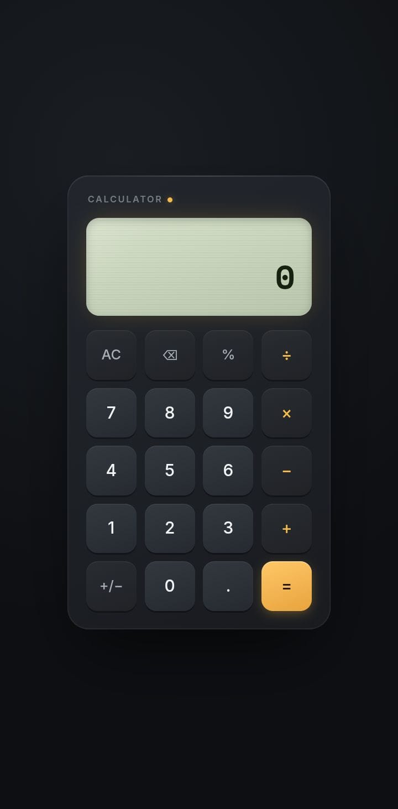

# Simple-Calculator
# 🧮 Simple Calculator

A clean and responsive calculator built using **HTML**, **CSS**, and **JavaScript**. It performs basic arithmetic operations with a modern user interface and keyboard support.

## ✨ Features

* ➕ Addition
* ➖ Subtraction
* ✖️ Multiplication
* ➗ Division
* 📊 Percentage calculations
* ⌨️ Keyboard support
* 📱 Responsive design
* 🎨 Modern and clean UI

## 🚀 Live Demo

🔗 https://simple-calculator-c01.netlify.app/
## 📸 Screenshot

## 🛠️ Technologies Used

* HTML5
* CSS3
* JavaScript (Vanilla)

## 👨‍💻 Author

**Bisma Batool**

If you like this project, consider giving it a ⭐ on GitHub!
